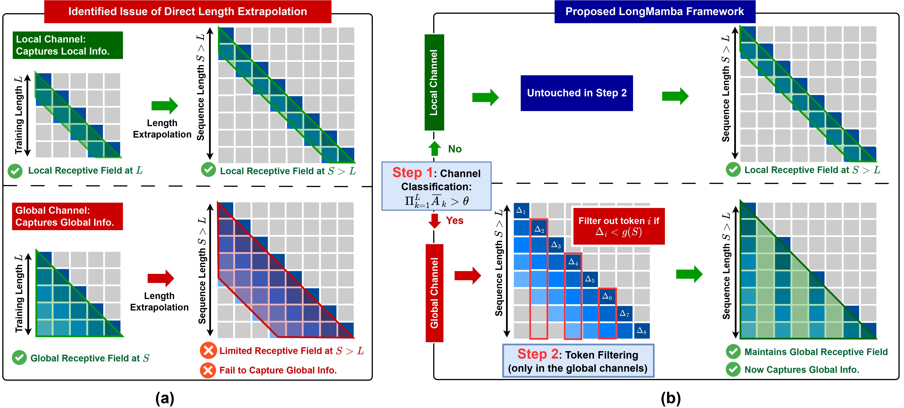

# LongMamba

> **LongMamba: Enhancing Mamba's Long Context Capabilities via Training-Free Receptive Field Enlargement**\
> Paper: https://arxiv.org/abs/2504.16053

## About

LongMamba is a training-free technique that significantly enhances the long-context capabilities of Mamba models. LongMamba builds on our discovery that the hidden channels in Mamba can be categorized into local and global channels based on their receptive field lengths, with global channels primarily responsible for long-context capability. These global channels can become the key bottleneck as the input context lengthens. Specifically, when input lengths largely exceed the training sequence length, global channels exhibit limitations in adaptively extend their receptive fields, leading to Mamba's poor long-context performance. The key idea of LongMamba is to mitigate the hidden state memory decay in these global channels by preventing the accumulation of unimportant tokens in their memory. This is achieved by first identifying critical tokens in the global channels and then applying token filtering to accumulate only those critical tokens.

## Getting Started

### 1. Install Environment

```bash
bash ./build_env.sh
```

This script will create a dedicated Python environment and install all required packages.

### 2. Prepare Data

Place the following datasets under the `./artifacts/` directory:

- **Align targets**: Download from [Google Drive link](https://drive.google.com/file/d/18Kw2XSWH1cCrDaPmdPZPWjTJTLF1IBDD/view?usp=sharing), unzip, and place under:
  ```
  ./artifacts/{base_model}-{align_folder}/
  ```
  Example: `./artifacts/mamba2-1.3b-longmamba/delta_t-thre/`

- **PG19 test sequences**: Download from [Google Drive link](https://drive.google.com/file/d/1MgpJ7kUPV6HeEuoEaDgkDKnW3K9smGJb/view?usp=sharing), unzip, and place under:
  ```
  ./artifacts/ppl_test/
  ```
  Example: `./artifacts/ppl_test/pg19/`
---

## Evaluation

### 3. Configuration Parameters

| Flag                  | Description                                                                                  | Default                            |
|-----------------------|----------------------------------------------------------------------------------------------|------------------------------------|
| `-lt`, `--long_eval_task` | Run LongBench evaluation (use `e` to run LongBench-E)                                    | `no`                               |
| `-dt`, `--deci_task`      | Run PG19 evaluation (use `pg19` to run PG19 task)                                        | `no`                               |
| `-ppl`, `--perplexity`    | Compute perplexity on a custom `.txt` dataset                                            | Disabled                           |
| `--model`             | Hugging Face model path or local checkpoint                                                  | `state-spaces/mamba2-1.3b`          |
| `--model_arch`        | Model architecture: `vanilla` or `ours`                                                      | `ours`                             |
| `--align_path`        | Name of the align folder without base model prefix (use `longmamba`)                         | `longmamba`                       |
| `--our_method`        | Different flitering methods (use `dt_thre`)                                                  | `dt_thre`                          |
| `--sample_path`       | Path to custom `.txt` file for perplexity calculation                                        | `subseq_lambada.txt`               |
| `-d`, `--device`      | CUDA device index                                                                            | `0`                                |

### 4. Running Evaluations

#### 4.1 LongBench Evaluation ("e" subset)
```bash
# vanilla
CUDA_VISIBLE_DEVICES=0 python my_evaluation.py \
  --model state-spaces/mamba2-1.3b \
  --model_arch vanilla \
  -lt e

# ours
CUDA_VISIBLE_DEVICES=0 python my_evaluation.py \
  --model state-spaces/mamba2-1.3b \
  --model_arch ours \
  --align_path longmamba-mamba2-1.3b \
  --our_method dt_thre \
  -lt e
```

#### 4.2 PG19 Evaluation
```bash
# vanilla
CUDA_VISIBLE_DEVICES=0 python my_evaluation.py \
  --model state-spaces/mamba2-1.3b \
  --model_arch vanilla \
  -dt pg19

# ours
CUDA_VISIBLE_DEVICES=0 python my_evaluation.py \
  --model state-spaces/mamba2-1.3b \
  --model_arch ours \
  --align_path longmamba-mamba2-1.3b \
  --our_method dt_thre \
  -dt pg19
```

#### 4.3 Custom Perplexity
```bash
# vanilla
CUDA_VISIBLE_DEVICES=0 python my_evaluation.py \
  --model state-spaces/mamba2-1.3b \
  --model_arch vanilla \
  -ppl \
  --sample_path subseq_lambada.txt

# ours
CUDA_VISIBLE_DEVICES=0 python my_evaluation.py \
  --model state-spaces/mamba2-1.3b \
  --model_arch ours \
  --align_path longmamba-mamba2-1.3b \
  --our_method dt_thre \
  -ppl \
  --sample_path subseq_lambada.txt
```


## Citation

If you find our work valuable, please consider citing our paper:
```
@inproceedings{ye2025longmamba,
  title={LongMamba: Enhancing Mamba's Long-Context Capabilities via Training-Free Receptive Field Enlargement},
  author={Zhifan Ye and Kejing Xia and Yonggan Fu and Xin Dong and Jihoon Hong and Xiangchi Yuan and Shizhe Diao and Jan Kautz and Pavlo Molchanov and Yingyan Celine Lin},
  booktitle={The Thirteenth International Conference on Learning Representations},
  year={2025},
  url={https://openreview.net/forum?id=fMbLszVO1H}
}
```
